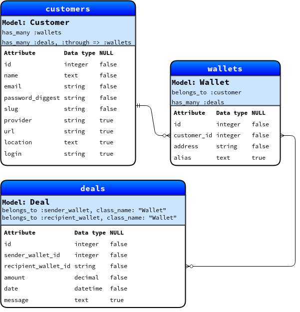

# La Wallet

This is a Ruby on Rails e-wallet project (REST API only).

The response types are sent using the [JSON API](http://jsonapi.org/) format.

### Models and Active Record Associations:

[Trello board](https://trello.com/b/aW1hcmXf/la-wallet)

## Prerequisites.

### Required software:
+ Ruby v2.5.1
+ Ruby on Rails v5.2.0

### Intall all the gems:
    bundle

### Run the tests:
    bundle exec rspec

### Create the database:
    bin/rails db:create

### Make migrations:
    bin/rails db:migrate

### Populate the database:
    bin/rails db:seed
###### Seed values are generated at random.

### Run the app:
    bin/rails s (to start the server)

# REST API
The **REST API** for *la-wallet* is described below:

## Get list of customers

### Request
`GET /customers/`
    curl -i -H 'Accept: application/json' http://localhost:3000/customers/
    
### Response
    HTTP/1.1 200 OK
    Content-Type: application/json; charset=utf-8
    ETag: W/"6a89e53ec0b459a7fb9ebffe60b3b1cb"
    Cache-Control: max-age=0, private, must-revalidate
    X-Request-Id: bf9221d5-6ad3-41cb-9c9d-6a838026e742
    X-Runtime: 0.014175
    Transfer-Encoding: chunked
    
    {"data":[{"id":"20","type":"customers","attributes":{"name":"Farengar Krex","url":"http://larson.org/cinderella","avatar-url":"http://emmerich.name/miles_denesik","provider":"Poliwhirl","slug":"ex_assumenda","email":"kathyrnskiles@wisoky.org","location":"Cote d'Ivoire"}}]}

## Get a specific number of customers

### Request
`GET /customers/?page=1&per_page=2`
    curl -i -H 'Accept: application/json' http://localhost:3000/customers\?page\=1\&per_page=2
    
### Response
    HTTP/1.1 200 OK
    Content-Type: application/json; charset=utf-8
    ETag: W/"651a047b7c9e088b2446ea1b7f1cc8ae"
    Cache-Control: max-age=0, private, must-revalidate
    X-Request-Id: 82545952-9876-4607-9441-d10686bc7d38
    X-Runtime: 0.003898
    Transfer-Encoding: chunked

    {"data":[{"id":"20","type":"customers","attributes":{"name":"Farengar Krex","url":"http://larson.org/cinderella","avatar-url":"http://emmerich.name/miles_denesik","provider":"Poliwhirl","slug":"ex_assumenda","email":"kathyrnskiles@wisoky.org","location":"Cote d'Ivoire"}},{"id":"19","type":"customers","attributes":{"name":"Nazir Mallory","url":"http://adams.io/booker.lindgren","avatar-url":"http://treutel.com/richie","provider":"Starmie","slug":"ullam.quo","email":"pei@kubsawayn.com","location":"Zambia"}}],"links":{"self":"http://localhost:3000/customers?page%5Bnumber%5D=1\u0026page%5Bsize%5D=2\u0026per_page=2","first":"http://localhost:3000/customers?page%5Bnumber%5D=1\u0026page%5Bsize%5D=2\u0026per_page=2","prev":null,"next":"http://localhost:3000/customers?page%5Bnumber%5D=2\u0026page%5Bsize%5D=2\u0026per_page=2","last":"http://localhost:3000/customers?page%5Bnumber%5D=10\u0026page%5Bsize%5D=2\u0026per_page=2"}}%
    
## Get list of wallets

### Request
`GET /wallets/`
    curl -i -H 'Accept: application/json' http://localhost:3000/wallets/
    
### Response
    HTTP/1.1 200 OK
    Content-Type: application/json; charset=utf-8
    ETag: W/"8527a9c868efb878043233c2fcf65573"
    Cache-Control: max-age=0, private, must-revalidate
    X-Request-Id: d76629c7-c574-4378-baaf-e79d492249d2
    X-Runtime: 0.015661
    Transfer-Encoding: chunked
    
    {"data":[{"id":"20","type":"wallets","attributes":{"customer-id":20,"address":"a2979f35d29c27b5f172aae683cd92040b58067f3bc5200633d5f02a5cb5e348","balance":"58193643.98","alias":"Ice Punch"}}]}

## Get a specific number of wallets

### Request
`GET /wallets/?page=1&per_page=2`
    curl -i -H 'Accept: application/json' http://localhost:3000/wallets\?page\=1\&per_page=2    

### Response
    HTTP/1.1 200 OK
    Content-Type: application/json; charset=utf-8
    ETag: W/"651a047b7c9e088b2446ea1b7f1cc8ae"
    Cache-Control: max-age=0, private, must-revalidate
    X-Request-Id: 82545952-9876-4607-9441-d10686bc7d38
    X-Runtime: 0.003898
    Transfer-Encoding: chunked

    {"data":[{"id":"20","type":"wallets","attributes":{"customer-id":20,"address":"a2979f35d29c27b5f172aae683cd92040b58067f3bc5200633d5f02a5cb5e348","balance":"58193643.98","alias":"Ice Punch"}},{"id":"19","type":"wallets","attributes":{"customer-id":19,"address":"9145cf916b1e5c8677fcfc93dae5f1a6ceddffa6477fd4f7a54a4e964b642722","balance":"681.52","alias":"Counter"}}],"links":{"self":"http://localhost:3000/wallets?page%5Bnumber%5D=1\u0026page%5Bsize%5D=2\u0026per_page=2","first":"http://localhost:3000/wallets?page%5Bnumber%5D=1\u0026page%5Bsize%5D=2\u0026per_page=2","prev":null,"next":"http://localhost:3000/wallets?page%5Bnumber%5D=2\u0026page%5Bsize%5D=2\u0026per_page=2","last":"http://localhost:3000/wallets?page%5Bnumber%5D=10\u0026page%5Bsize%5D=2\u0026per_page=2"}}    
